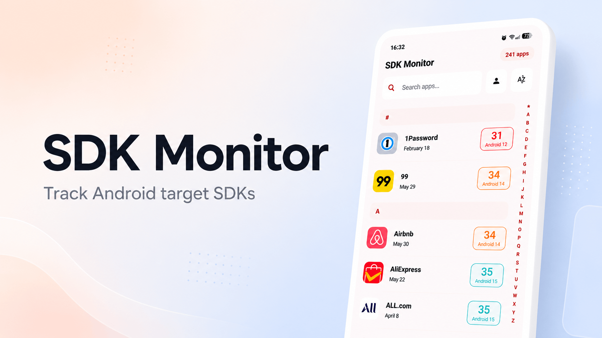
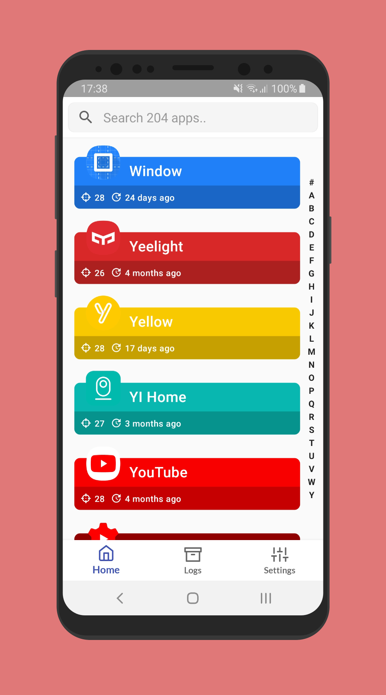
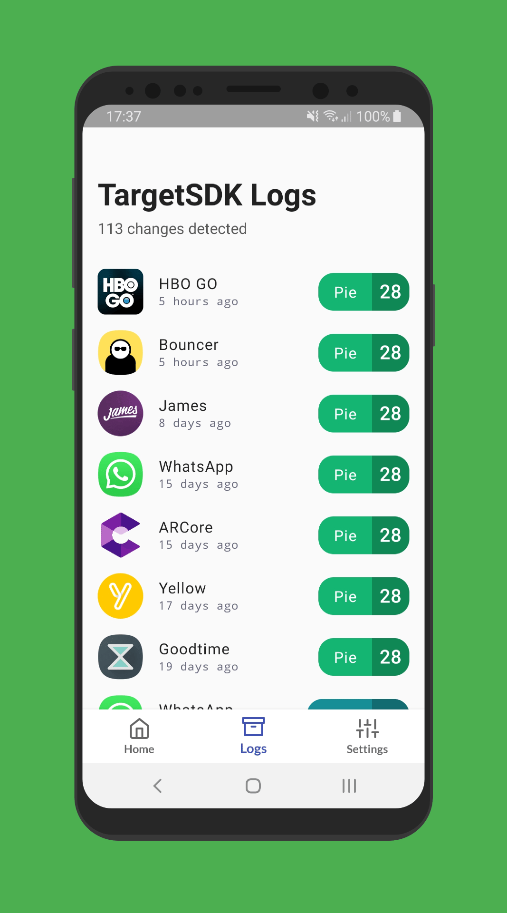
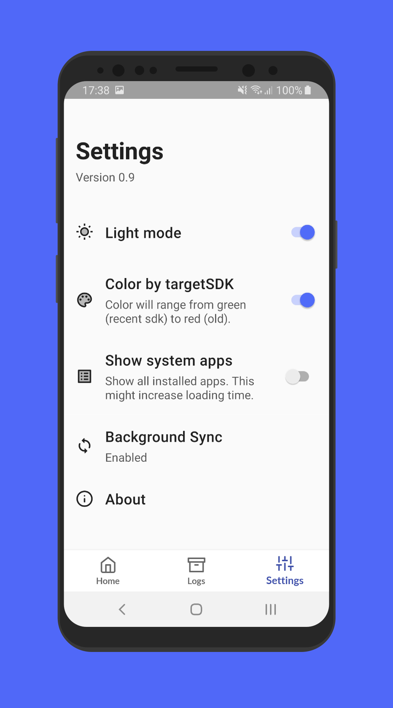

# SDK Monitor

**See which Android API level every installed app is targeting — and get notified when it changes.**

Android does not surface `targetSdk` anywhere in Settings. SDK Monitor reads it from your installed apps, tracks updates over time, and shows you which apps are actually adopting newer security and privacy protections.

[](https://f-droid.org/packages/com.bernaferrari.sdkmonitor/)

## Get it

[](https://f-droid.org/packages/com.bernaferrari.sdkmonitor/)

[Download from GitHub Releases](https://github.com/bernaferrari/SDKMonitor/releases/latest)

## Screenshots

| Home | Change logs | App details | Settings |
| :--: | :---------: | :---------: | :------: |
|  |  |  |  |

## Features

- **Target SDK at a glance** — Every installed app, sorted and searchable
- **Change history** — See when an app bumps (or drops) its `targetSdk`
- **Notifications** — Get alerted when a Play Store app changes its target level
- **SDK analytics** — Charts showing how your app library is distributed across API levels
- **App details** — Permissions, install dates, min/target SDK side by side
- **CSV export** — Back up your data without leaving the device
- **Fully offline** — No account, no cloud, no network access required

Available in English, Italian, French, Portuguese (BR), German, Spanish, Japanese, and Chinese.

## Building from source

Open the project in a recent Android Studio and run it. Or from the terminal:

```bash
git clone https://github.com/bernaferrari/SDKMonitor.git
cd SDKMonitor
./gradlew assembleDebug
```

## What each target SDK level means for security and privacy

Higher API levels mean apps must adopt newer platform protections.

- **API 37** (Android 17): Advanced Protection Mode, post-quantum APK signing, Live Update APIs
- **API 36** (Android 16): Local network permission, adaptive layout requirements, health data permission changes
- **API 35** (Android 15): Private space, edge-to-edge enforcement, stricter foreground service limits
- **API 34** (Android 14): Partial photo/video access
- **API 33** (Android 13): Themed app icons, per-app language preferences, notification permission
- **API 32** (Android 12L): Improved large screen support, new splash screen API
- **API 31** (Android 12): Material You, approximate location permission, clipboard access notifications
- **API 30** (Android 11): Scoped storage enforcement, one-time permissions, background location restrictions
- **API 29** (Android 10): Scoped storage (optional), dark theme, gesture navigation
- **API 28** (Android 9): Network security config required, Apache HTTP client removed
- **API 26–27** (Android 8.x): Background execution limits, notification channels, adaptive icons
- **API 24–25** (Android 7.x): File provider requirements, doze mode, multi-window support
- **Below API 24**: Missing modern security and privacy features